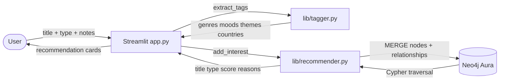
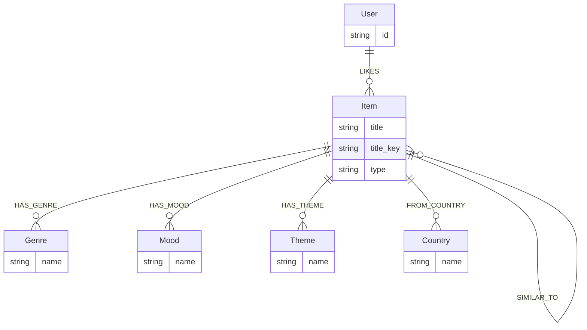

# TasteGraph

> TasteGraph turns your interests into an explainable recommendation graph across books, manga, shows, films, and music.

You enter things you like. TasteGraph extracts moods, themes, genres, and cultural signals, stores them as a graph in Neo4j, and recommends related media with clear reasons for each match.

**Example recommendation:**
> Recommended **Reply 1988** because it shares `nostalgia`, `friendship`, `coming-of-age`, `south korea` with your taste graph.

---

## Problem

Recommendation engines are black boxes. You get a list with no explanation. TasteGraph flips that — every recommendation is backed by visible graph connections you can inspect.

---

## Solution

- User interests are stored as graph nodes in Neo4j
- Each item is connected to shared tag nodes (Genre, Mood, Theme, Country)
- Recommendations are ranked by how many tags overlap with what you already like
- The app shows the exact tags driving each match

---

## Tech Stack

| Layer | Technology |
|---|---|
| UI | Streamlit |
| Language | Python 3 |
| Database | Neo4j Aura (cloud) |
| DB driver | `neo4j` Python driver |
| Config | `python-dotenv` |

---

## File Layout

```
InterestMap/
├── app.py                   # Streamlit app — main entry point
├── requirements.txt         # Python dependencies
├── .env                     # Neo4j credentials (not committed)
├── ReadME.md
├── agents.md                # Agent operating manual for this repo
│
├── lib/                     # Core Python modules
│   ├── __init__.py
│   ├── neo4j_client.py      # Driver setup, connection test, database config
│   ├── recommender.py       # Graph writes, recommendation queries, seed data
│   ├── tagger.py            # Tag extraction (Kimchi Kimi-K2.6 if configured, else rule-based)
│   └── mdl_importer.py      # MyDramaList completed-list importer
│
└── scripts/                 # Terminal utilities (also work as fallback demo)
    ├── test_connection.py   # Checks Neo4j is reachable
    ├── seed.py              # Seeds demo items into Neo4j
    ├── recommend.py         # Prints recommendations for demo-user to terminal
    └── import_mdl.py        # Imports a public MDL completed list into Neo4j
```

---

## System Architecture



### Graph data model



---

## Graph Schema

### Node labels

| Label | Properties |
|---|---|
| `User` | `id` |
| `Item` | `title`, `title_key`, `type` |
| `Genre` | `name` |
| `Mood` | `name` |
| `Theme` | `name` |
| `Country` | `name` |

### Relationship types

| Relationship | Meaning |
|---|---|
| `(User)-[:LIKES]->(Item)` | User has added this interest |
| `(Item)-[:HAS_GENRE]->(Genre)` | Item belongs to a genre |
| `(Item)-[:HAS_MOOD]->(Mood)` | Item has a mood signal |
| `(Item)-[:HAS_THEME]->(Theme)` | Item has a theme |
| `(Item)-[:FROM_COUNTRY]->(Country)` | Item originates from a country |

### Deduplication rules

- Items are identified by `(title_key, type)` — same title across different media types is intentionally separate
- Tags are normalised to lowercase before storing — `Drama`, `DRAMA`, `drama` all become one node
- Every write runs a dedup pass to merge any existing duplicates

---

## Recommendation Scoring

Shared tag types and their contribution to score:

| Signal | Points |
|---|---|
| Shared genre | 1 |
| Shared mood | 1 |
| Shared theme | 1 |
| Shared country | 1 |

Results are sorted by score descending. Every recommendation includes the exact tag names as reasons.

---

## Setup

### 1. Install dependencies

```bash
pip install -r requirements.txt
```

### 2. Configure `.env`

Your `.env` file must define:

```env
NEO4J_URI=neo4j+s://<your-instance>.databases.neo4j.io
NEO4J_USERNAME=neo4j
NEO4J_PASSWORD=<your-password>
NEO4J_DATABASE=<your-database-name>
```

`NEO4J_DATABASE` is the Aura instance database name (shown in Aura Console). If omitted, the driver default is used.

Optional Kimchi LLM config for AI tag extraction:

```env
KIMCHI_API_KEY=<your-kimchi-bearer-token>
KIMCHI_BASE_URL=https://llm.kimchi.dev/openai/v1
KIMCHI_MODEL=kimi-k2.6
```

Compatibility aliases are also supported from your current `.env`:
`Kimchi_api_key`, `kimi-k2.6_api_key`, `kimi-k2.6_url`, and `NEO4J_queryAPI_URL`.

### 3. Run the app

```bash
streamlit run app.py
```

---

## Demo Flow

1. Open the app in the browser
2. Click **Load demo graph** in the sidebar to seed 8 pre-built items
3. Browse the recommendation cards and explanation panel
4. Use **Add to TasteGraph** to add your own interest and extend the graph

---

## Fallback Terminal Demo

If the UI is unavailable, the full graph system still works from the terminal:

```bash
# Check connection
python scripts/test_connection.py

# Seed demo data
python scripts/seed.py

# Print recommendations
python scripts/recommend.py
```

---

## Known Limitations

- Tag extraction falls back to rule-based keywords when Kimchi credentials are not configured
- Country detection is inferred from media type, not actual metadata
- No user accounts — all data is keyed by a user id string you set in the sidebar
- MDL import depends on public profiles and may break if MyDramaList page structure changes
