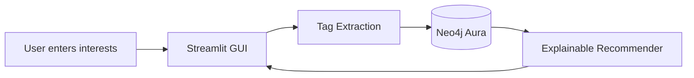

# agent.md — TasteGraph Agent Operating Manual

## 0. Purpose of This File

This file tells every AI agent working on this repository exactly what to do, what not to do, which files they own, and how to avoid breaking the project.

The goal is to prevent agents from going off the rails during a fast hackathon build.

---

## 1. Project Summary

**Project name:** TasteGraph

**One-line pitch:**

> TasteGraph is an explainable cross-media interest graph that recommends books, manga, shows, films, and music based on shared moods, themes, genres, creators, and cultural signals.

Users enter interests such as:

- books
- manga
- graphic novels
- movies
- TV shows
- K-dramas
- anime
- music artists
- albums
- songs

TasteGraph stores these interests in Neo4j and recommends related media with clear explanations.

Example explanation:

> Recommended **Reply 1988** because it shares nostalgia, coming-of-age, friendship, and emotionally grounded relationships with your existing taste graph.

---

## 2. Current Build Direction

This project uses a **Python GUI from PyPI**, not Figma AI source files.

The preferred GUI framework is:

- **Streamlit**

Reason:

- fastest local GUI for a hackathon
- easy to install from PyPI
- simple forms, buttons, cards, and charts
- runs in the browser
- minimal frontend engineering required

Do not use:

- Figma-generated frontend files
- Next.js
- React
- Tailwind
- complex frontend routing

unless the project owner explicitly changes direction again.

---

## 3. Tech Stack

### App

- Python
- Streamlit
- Neo4j Python Driver
- python-dotenv

### Database

- Neo4j Aura

### AI / Agent Tooling

- VS Code Insiders fleets
- Kimchi / Kimi-K2.6
- MiniMax-M2.5
- Claude
- Copilot
- Codex 5.4

### Installed Tessl Skills

Installed:

- `simon/skills`
- `mermaid-studio`
- `rails-agent-skills`

Skipped / Do not use:

- `markdown-document-structurer`

Reason:

- Tessl flagged it as risky due to insecure credential handling.

---

## 4. Core Product Goal

Build a working demo where:

1. User enters interests.
2. App extracts or assigns tags.
3. Interests are saved to Neo4j.
4. Neo4j stores the interest graph.
5. App recommends related media.
6. Each recommendation includes reasons.

The most important feature is **explainability**.

A recommendation without reasons is incomplete.

---

## 5. Non-Goals

Do not build these unless the MVP is already working:

- login
- user accounts
- authentication
- scraping
- vector database
- embeddings
- complex ML
- payment systems
- deployment pipelines
- mobile app
- social features
- multi-user collaboration
- complex graph algorithms
- Neo4j GDS setup

This is a hackathon MVP, not a production system.

---

## 6. Global Rules for All Agents

### Rule 1 — Preserve Working Code

Never rewrite a working file from scratch unless explicitly told to.

Prefer:

- small patches
- isolated fixes
- readable changes
- minimal dependencies

Avoid:

- large rewrites
- unnecessary refactors
- framework changes
- new architecture patterns

---

### Rule 2 — Keep the MVP Working at All Times

At every stage, the project should remain runnable.

Primary run command:

```bash
streamlit run app.py
```

Fallback commands:

```bash
python scripts/test_connection.py
python scripts/seed.py
python scripts/recommend.py
```

If an agent changes code, they should preserve or restore one of these working paths.

---

### Rule 3 — Environment and Secret Handling

A local `.env` file already exists and contains the Neo4j credentials.

Agents must not:

- overwrite `.env`
- recreate `.env`
- ask the project owner for Neo4j credentials again
- print Neo4j credentials
- commit `.env`
- copy secrets into README, DEMO, ARCHITECTURE, AGENTS, logs, screenshots, or terminal output

Agents must load credentials from `.env` using `python-dotenv`.

Required environment variables:

```env
NEO4J_URI=
NEO4J_USERNAME=neo4j
NEO4J_PASSWORD=
```
---

### Rule 4 — Keep Claims Honest

Do not claim the project uses:

- proprietary ML
- production recommendation AI
- advanced embeddings
- fully trained models
- production security
- enterprise scalability

Correct description:

> TasteGraph uses graph relationships and explainable scoring in Neo4j to recommend related interests.

---

### Rule 5 — Prefer Simple Python

Write code that is:

- explicit
- readable
- beginner-friendly
- easy to demo
- easy to debug

Avoid:

- excessive classes
- unnecessary abstraction layers
- metaprogramming
- clever one-liners
- hidden side effects

---

### Rule 6 — Every Recommendation Needs Reasons

Every recommendation must return:

- title
- media type
- score
- reasons

Example:

```python
{
    "title": "Reply 1988",
    "type": "kdrama",
    "score": 5,
    "reasons": ["nostalgia", "friendship", "coming-of-age"],
}
```

---

## 7. Repository Structure

Use this structure unless explicitly changed by the project owner.

```txt
.
├── app.py
├── requirements.txt
├── .env
├── README.md
├── DEMO.md
├── ARCHITECTURE.md
├── AGENTS.md
├── lib/
│   ├── __init__.py
│   ├── neo4j_client.py
│   ├── recommender.py
│   └── tagger.py
└── scripts/
    ├── seed.py
    ├── test_connection.py
    └── recommend.py
```

---

## 8. Agent Roles

## 8.1 Claude — Architecture and Documentation Lead

### Primary responsibility

Claude keeps the project coherent.

Claude owns:

```txt
README.md
DEMO.md
ARCHITECTURE.md
AGENTS.md
```

Claude uses:

```txt
mermaid-studio
```

### Tasks

Claude should:

- define architecture
- keep scope tight
- write documentation
- create demo story
- create Mermaid diagrams
- review overall project consistency
- stop other agents from overengineering

### Claude must not:

- rewrite stable code unnecessarily
- invent unavailable Tessl skills
- change the chosen stack without instruction
- add complex infrastructure

### Claude output should include:

- clear setup instructions
- judge-friendly explanations
- concise diagrams
- fallback demo instructions

---

## 8.2 Kimchi / Kimi-K2.6 — Neo4j Graph Agent

### Primary responsibility

Kimchi / Kimi-K2.6 owns the graph database and recommendation logic.

Owns:

```txt
lib/recommender.py
scripts/seed.py
scripts/recommend.py
```

### Tasks

Kimchi / Kimi-K2.6 should:

- create Neo4j schema
- write Cypher queries
- create seed data
- build recommendation scoring
- return explanation paths
- make graph logic easy to test

### Kimchi / Kimi-K2.6 must not:

- change GUI code
- add complex graph algorithms
- require Neo4j GDS
- change environment variable names
- overcomplicate scoring

### Graph node labels

```cypher
(:User)
(:Item)
(:Genre)
(:Mood)
(:Theme)
(:Creator)
(:Country)
```

### Relationship types

```cypher
(:User)-[:LIKES]->(:Item)
(:User)-[:WATCHED]->(:Item)
(:User)-[:READ]->(:Item)
(:User)-[:LISTENED_TO]->(:Item)

(:Item)-[:HAS_GENRE]->(:Genre)
(:Item)-[:HAS_MOOD]->(:Mood)
(:Item)-[:HAS_THEME]->(:Theme)
(:Item)-[:CREATED_BY]->(:Creator)
(:Item)-[:FROM_COUNTRY]->(:Country)
(:Item)-[:SIMILAR_TO]->(:Item)
```

### Core recommendation behaviour

A recommendation should be based on shared traits between liked items and candidate items.

Example logic:

```cypher
MATCH (u:User {id: $user_id})-[:LIKES|WATCHED|READ|LISTENED_TO]->(liked:Item)
MATCH (liked)-[:HAS_GENRE|HAS_MOOD|HAS_THEME|CREATED_BY|FROM_COUNTRY]->(tag)
MATCH (rec:Item)-[:HAS_GENRE|HAS_MOOD|HAS_THEME|CREATED_BY|FROM_COUNTRY]->(tag)
WHERE NOT (u)-[:LIKES|WATCHED|READ|LISTENED_TO]->(rec)
RETURN
  rec.title AS title,
  rec.type AS type,
  count(DISTINCT tag) AS score,
  collect(DISTINCT tag.name) AS reasons
ORDER BY score DESC
LIMIT $limit
```

---

## 8.3 MiniMax-M2.5 — Python Integration Agent

### Skill

Use:

```txt
simon/skills
```

### Primary responsibility

MiniMax-M2.5 wires the project together.

Owns:

```txt
app.py
lib/neo4j_client.py
lib/tagger.py
requirements.txt
```

### Tasks

MiniMax-M2.5 should:

- connect Streamlit to Neo4j
- load `.env`
- make `streamlit run app.py` work
- wire tag extraction to graph insertion
- wire graph recommendations to GUI
- handle runtime errors cleanly
- keep all modules importable

### MiniMax-M2.5 must not:

- change graph schema without approval
- add large dependencies
- replace Streamlit
- rewrite documentation
- change database credentials format

### Integration requirements

The app must not crash when:

- input is empty
- Neo4j is unavailable
- there are no recommendations yet
- tags are missing
- seed data has not been loaded

Instead, show a useful message.

---

## 8.4 GUI Agent — Streamlit Interface Agent

### Primary responsibility

The GUI Agent builds the visible demo.

Owns:

```txt
app.py
```

### Required UI sections

The Streamlit app must include:

1. Project title
2. One-line pitch
3. Interest input form
4. Media type selector
5. Submit button
6. Taste profile / extracted tags
7. Recommendation cards
8. Explanation section

### User input fields

Minimum input:

- title
- media type

Optional input:

- notes
- mood
- theme
- genre

### Recommendation card format

Each recommendation card should show:

```txt
Title
Type
Score
Because: reason 1, reason 2, reason 3
```

### GUI Agent must not:

- create a multi-page app before MVP works
- add login
- add complex custom CSS
- change Neo4j queries
- add frontend frameworks

---

## 8.5 Codex 5.4 — Code Cleanup Agent

### Primary responsibility

Codex 5.4 fixes broken code and cleans up implementation details.

Owns:

```txt
app.py
lib/*.py
scripts/*.py
```

### Tasks

Codex 5.4 should:

- fix Python syntax errors
- clean imports
- remove dead code
- simplify functions
- improve error handling
- keep files organized

### Codex 5.4 must not:

- change product direction
- rewrite the full app
- introduce unnecessary abstractions
- change database schema
- remove fallback scripts

---

## 8.6 Copilot — Small Assist Agent

### Primary responsibility

Copilot helps with quick snippets only.

Copilot may help with:

- small UI snippets
- simple helper functions
- docstring drafts
- boilerplate

Copilot must not:

- take over architecture
- rewrite complete files
- introduce new frameworks
- change the stack

---

## 9. Installed Tessl Skill Usage

## 9.1 `simon/skills`

Use with:

- MiniMax-M2.5

For:

- code integration
- module wiring
- debugging broken flows
- making the app run end-to-end

Do not use it to change product scope.

---

## 9.2 `mermaid-studio`

Use with:

- Claude
- Documentation Agent

For:

- architecture diagrams
- graph schema diagrams
- recommendation flow diagrams

---

## 9.3 `rails-agent-skills`

Do not use unless the project pivots to Ruby on Rails.

Current project is Python + Streamlit.

---

## 9.4 `markdown-document-structurer`

Do not use.

It was skipped after Tessl flagged a security issue.

---

## 10. Python Function Contracts

## 10.1 `get_driver`

Location:

```txt
lib/neo4j_client.py
```

Signature:

```python
get_driver()
```

Purpose:

Return a Neo4j driver using environment variables.

---

## 10.2 `test_connection`

Location:

```txt
lib/neo4j_client.py
```

Signature:

```python
test_connection() -> bool
```

Purpose:

Return `True` if Neo4j connection works.

---

## 10.3 `add_interest`

Location:

```txt
lib/recommender.py
```

Signature:

```python
add_interest(
    user_id: str,
    title: str,
    media_type: str,
    tags: dict
) -> None
```

Purpose:

Add a user interest and connect it to tag nodes.

---

## 10.4 `get_recommendations`

Location:

```txt
lib/recommender.py
```

Signature:

```python
get_recommendations(user_id: str, limit: int = 5) -> list[dict]
```

Expected output:

```python
[
    {
        "title": "Reply 1988",
        "type": "kdrama",
        "score": 5,
        "reasons": ["nostalgia", "friendship", "coming-of-age"],
    }
]
```

---

## 10.5 `extract_tags`

Location:

```txt
lib/tagger.py
```

Signature:

```python
extract_tags(title: str, media_type: str, notes: str = "") -> dict
```

Expected output:

```python
{
    "genres": ["drama"],
    "moods": ["nostalgic", "emotional"],
    "themes": ["coming-of-age", "friendship"],
    "creators": [],
    "countries": ["South Korea"]
}
```

For the MVP, this function may use simple rule-based fallback data instead of LLM calls.

---

## 11. Recommendation Scoring Rules

Keep scoring simple.

Suggested scoring:

- shared genre = 1 point
- shared mood = 1 point
- shared theme = 1 point
- shared creator = 2 points
- shared country = 1 point

Sort recommendations by descending score.

Do not add advanced weighting until the MVP works.

---

## 12. Seed Data Requirements

The seed data should include at least:

### Books / Manga / Graphic Novels

- Nana
- Blue Period
- Normal People
- Heartstopper
- Honey and Clover

### Shows / Movies / K-Dramas / Anime

- Twenty-Five Twenty-One
- Reply 1988
- Your Name
- Everything Everywhere All At Once
- Hospital Playlist

### Music

- NewJeans
- Beabadoobee
- Laufey
- Mitski
- Wave to Earth

Seed data must include tags such as:

- nostalgia
- coming-of-age
- friendship
- romance
- melancholy
- identity
- found family
- emotional realism
- dreamy
- youth

---

## 13. Streamlit UX Requirements

The app should be understandable in under 10 seconds.

Recommended layout:

```txt
Title
Short pitch
Add interest form
Taste profile section
Recommendations section
Explanation section
```

Example copy:

```txt
TasteGraph maps what you love across books, shows, manga, films, and music — then recommends new things through explainable graph connections.
```

Buttons:

```txt
Add to TasteGraph
Get recommendations
Reset demo user
```

Avoid clutter.

---

## 14. Documentation Requirements

## 14.1 README.md

Must include:

- project name
- one-line pitch
- problem
- solution
- tech stack
- sponsor/tool usage
- setup instructions
- `.env` instructions
- GUI run command
- fallback terminal commands

---

## 14.2 DEMO.md

Must include:

- 60-second pitch
- 2-minute walkthrough
- expected judge questions
- fallback terminal demo

---

## 14.3 ARCHITECTURE.md

Must include:

- system overview
- graph schema
- recommendation flow
- Mermaid diagram
- known limitations

Example Mermaid diagram:



---

## 15. MVP Definition of Done

The project is demo-ready when:

- `streamlit run app.py` starts successfully
- user can enter an interest
- user can select a media type
- the interest is saved to Neo4j
- app can fetch recommendations
- every recommendation includes reasons
- seed script works
- test connection script works
- README explains setup
- terminal fallback works

---

## 16. Emergency Fallback Plan

If the GUI breaks, demo from terminal.

Commands:

```bash
python scripts/test_connection.py
python scripts/seed.py
python scripts/recommend.py
```

Fallback explanation:

> The GUI is optional. The core graph system still works: interests are stored in Neo4j, and recommendations are generated from shared graph traits with explanations.

---

## 17. Agent Conflict Resolution

If agents disagree:

1. Preserve the working demo.
2. Follow this `AGENTS.md`.
3. Claude resolves architecture questions.
4. Kimchi / Kimi-K2.6 resolves Neo4j questions.
5. MiniMax-M2.5 resolves integration questions.
6. Codex 5.4 resolves Python cleanup questions.

No agent should silently change another agent’s owned area without a clear reason.

---

## 18. Final Demo Narrative

Use this story:

1. “I enter a few things I like.”
2. “TasteGraph extracts moods, themes, and genres.”
3. “Neo4j stores those as a graph.”
4. “The recommender looks for shared connections.”
5. “The app explains why each recommendation fits.”

Main demo sentence:

> TasteGraph turns your interests into an explainable recommendation graph across books, shows, manga, films, and music.

---

## 19. Non-Negotiable

A smaller working project is better than a larger broken project.

Do not chase impressive features at the cost of a working demo.
